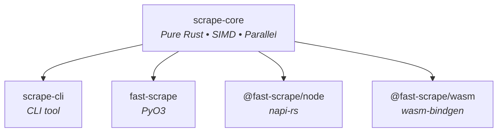

# fast-scrape

[](https://github.com/bug-ops/scrape-rs/actions)
[](https://codecov.io/gh/bug-ops/scrape-rs)
[](https://crates.io/crates/scrape-core)
[](https://pypi.org/project/fast-scrape)
[](https://www.npmjs.com/package/@fast-scrape/node)
[](LICENSE-MIT)

**10-50x faster** HTML parsing for Rust, Python, Node.js, and browsers.

```
pip install fast-scrape          # Python
npm install @fast-scrape/node    # Node.js
npm install @fast-scrape/wasm    # Browser/WASM
cargo add scrape-core            # Rust library
cargo install scrape-cli         # CLI tool
```

## Quick start

<details open>
<summary><strong>Python</strong></summary>

```python
from scrape_rs import Soup

soup = Soup("<html><body><div class='content'>Hello</div></body></html>")

div = soup.find("div")
print(div.text)  # Hello

for el in soup.select("div.content"):
    print(el.inner_html)
```

</details>

<details>
<summary><strong>Node.js</strong></summary>

```javascript
import { Soup } from '@fast-scrape/node';

const soup = new Soup("<html><body><div class='content'>Hello</div></body></html>");

const div = soup.find("div");
console.log(div.text);  // Hello

for (const el of soup.select("div.content")) {
    console.log(el.innerHTML);
}
```

</details>

<details>
<summary><strong>Rust</strong></summary>

```rust
use scrape_core::Soup;

let soup = Soup::new("<html><body><div class='content'>Hello</div></body></html>");

let div = soup.find("div").unwrap();
println!("{}", div.text());  // Hello

for el in soup.select("div.content") {
    println!("{}", el.inner_html());
}
```

> [!IMPORTANT]
> Requires Rust 1.88 or later.

</details>

<details>
<summary><strong>Browser (WASM)</strong></summary>

```javascript
import init, { Soup } from '@fast-scrape/wasm';

await init();

const soup = new Soup("<html><body><div class='content'>Hello</div></body></html>");
console.log(soup.find("div").text);  // Hello
```

</details>

<details>
<summary><strong>CLI</strong></summary>

```bash
# Extract text from HTML file
scrape 'h1' page.html

# Extract from URL via curl
curl -s example.com | scrape 'title'

# Output as JSON
scrape -o json 'a[href]' page.html
```

</details>

## Performance

Benchmarked against BeautifulSoup4 (Python) and Cheerio (Node.js):

<details open>
<summary><strong>Parse speed</strong></summary>

| File size | fast-scrape | BeautifulSoup | Speedup |
|-----------|-------------|---------------|---------|
| 1 KB | 0.024 ms | 0.230 ms | **9.7x** |
| 219 KB | 3.1 ms | 28.2 ms | **9.2x** |
| 5.9 MB | 97.2 ms | 1031.6 ms | **10.6x** |

</details>

<details>
<summary><strong>Query speed</strong></summary>

| Operation | fast-scrape | BeautifulSoup | Speedup |
|-----------|-------------|---------------|---------|
| `find("div")` | 0.001 ms | 0.016 ms | **20x** |
| `find(".class")` | 0.006 ms | 0.797 ms | **132x** |
| `find("#id")` | 0.027 ms | 0.799 ms | **30x** |
| `select(".class")` | 0.110 ms | 4.361 ms | **40x** |

</details>

> [!TIP]
> Run `python benches/compare_python.py` to benchmark on your hardware.

## Features

- **Fast** — 10-50x faster than BeautifulSoup/Cheerio
- **Cross-platform** — Rust, Python, Node.js, and browsers
- **Consistent API** — Same interface everywhere
- **Memory-safe** — Pure Rust core, zero unsafe code
- **SIMD-accelerated** — Auto-detects SSE4.2, AVX2, NEON, WASM SIMD

<details>
<summary><strong>Rust feature flags</strong></summary>

```toml
[dependencies]
scrape-core = { version = "0.1", features = ["simd", "parallel"] }
```

| Feature | Description | Default |
|---------|-------------|---------|
| `simd` | SIMD-accelerated parsing | No |
| `parallel` | Parallel batch processing via Rayon | No |

> [!NOTE]
> Python and Node.js bindings enable both features by default. WASM uses `simd` only (no threads).

</details>

## Architecture



### Built on Servo

The core is powered by battle-tested libraries from the [Servo](https://servo.org/) browser engine:

- [html5ever](https://crates.io/crates/html5ever) — Spec-compliant HTML5 parser
- [selectors](https://crates.io/crates/selectors) — CSS selector matching engine
- [cssparser](https://crates.io/crates/cssparser) — CSS parser

<details>
<summary><strong>Project structure</strong></summary>

```
crates/
├── scrape-core/    # Pure Rust library
├── scrape-cli/     # Command-line tool
├── scrape-py/      # Python bindings (PyO3)
├── scrape-node/    # Node.js bindings (napi-rs)
└── scrape-wasm/    # WASM bindings (wasm-bindgen)
```

</details>

## Contributing

Contributions welcome! See [CONTRIBUTING.md](CONTRIBUTING.md) for guidelines.

## License

MIT OR Apache-2.0
