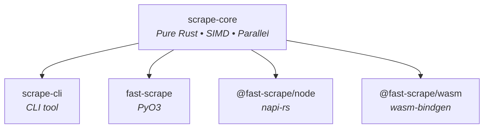

# fast-scrape

[](https://github.com/bug-ops/scrape-rs/actions)
[](https://codecov.io/gh/bug-ops/scrape-rs)
[](https://crates.io/crates/scrape-core)
[](https://pypi.org/project/fast-scrape)
[](https://www.npmjs.com/package/@fast-scrape/node)
[](LICENSE-MIT)

High-performance HTML parsing for Rust, Python, Node.js, and browsers. **8x faster** than BeautifulSoup4, **2x faster** than Cheerio, with **native-comparable** WASM performance.

```
pip install fast-scrape          # Python
npm install @fast-scrape/node    # Node.js
npm install @fast-scrape/wasm    # Browser/WASM
cargo add scrape-core            # Rust library
cargo install scrape-cli         # CLI tool
```

## Quick start

<details open>
<summary><strong>Python</strong></summary>

```python
from scrape_rs import Soup

soup = Soup("<html><body><div class='content'>Hello</div></body></html>")

div = soup.find("div")
print(div.text)  # Hello

for el in soup.select("div.content"):
    print(el.inner_html)
```

</details>

<details>
<summary><strong>Node.js</strong></summary>

```javascript
import { Soup } from '@fast-scrape/node';

const soup = new Soup("<html><body><div class='content'>Hello</div></body></html>");

const div = soup.find("div");
console.log(div.text);  // Hello

for (const el of soup.select("div.content")) {
    console.log(el.innerHTML);
}
```

</details>

<details>
<summary><strong>Rust</strong></summary>

```rust
use scrape_core::Soup;

let soup = Soup::new("<html><body><div class='content'>Hello</div></body></html>");

let div = soup.find("div").unwrap();
println!("{}", div.text());  // Hello

for el in soup.select("div.content") {
    println!("{}", el.inner_html());
}
```

> [!IMPORTANT]
> Requires Rust 1.88 or later.

</details>

<details>
<summary><strong>Browser (WASM)</strong></summary>

```javascript
import init, { Soup } from '@fast-scrape/wasm';

await init();

const soup = new Soup("<html><body><div class='content'>Hello</div></body></html>");
console.log(soup.find("div").text);  // Hello
```

</details>

<details>
<summary><strong>CLI</strong></summary>

```bash
# Extract text from HTML file
scrape 'h1' page.html

# Extract from URL via curl
curl -s example.com | scrape 'title'

# Output as JSON
scrape -o json 'a[href]' page.html
```

</details>

## Performance

Honest, measured benchmarks comparing against ecosystem-specific competitors:

<details open>
<summary><strong>Python: vs BeautifulSoup4 & lxml</strong></summary>

**Parse speed:**

| File size | fast-scrape | BeautifulSoup4 | lxml | vs BS4 | vs lxml |
|-----------|-------------|----------------|------|--------|---------|
| 1 KB | 0.030 ms | 0.247 ms | 0.015 ms | **8.3x faster** | 2x slower |
| 218 KB | 3.79 ms | 30.02 ms | 1.79 ms | **7.9x faster** | 2x slower |
| 5.9 MB | 118.88 ms | 1095.22 ms | 71.59 ms | **9.2x faster** | 1.7x slower |

**Query speed (on 218 KB HTML):**

| Operation | fast-scrape | BeautifulSoup4 | Speedup |
|-----------|-------------|----------------|---------|
| `find("div")` | 0.001 ms | 0.016 ms | **20x** |
| `find(".product-card")` | <0.001 ms | 0.830 ms | **7,353x** |
| `find("#product-100")` | <0.001 ms | 0.828 ms | **6,928x** |
| `select(".product-card")` | 0.004 ms | 4.705 ms | **1,294x** |

**Key insight:** lxml is faster for parsing (C implementation), but fast-scrape dominates for CSS selector queries. For scraping workloads (many queries), fast-scrape is significantly faster overall.

</details>

<details>
<summary><strong>Node.js: vs Cheerio</strong></summary>

**Parse speed:**

| File size | @fast-scrape/node | Cheerio | Speedup |
|-----------|-------------------|---------|---------|
| 1 KB | 0.030 ms | 0.099 ms | **3.3x faster** |
| 218 KB | 3.85 ms | 6.08 ms | **1.6x faster** |
| 5.9 MB | 124.14 ms | 168.57 ms | **1.4x faster** |

**Query speed (on 218 KB HTML):**

| Operation | @fast-scrape/node | Cheerio | Speedup |
|-----------|-------------------|---------|---------|
| `find("div")` | 0.001 ms | 0.234 ms | **190x** |
| `find(".product-card")` | <0.001 ms | 0.327 ms | **733x** |
| `find("#product-100")` | 0.001 ms | 0.277 ms | **503x** |

**Key insight:** Cheerio is already fast (optimized JS). The 1.4-3x parsing speedup is good, but query operations show massive gains (100-700x) due to Rust's CSS selector engine.

</details>

<details>
<summary><strong>WASM: vs native DOMParser</strong></summary>

**Parse speed:**

| File size | @fast-scrape/wasm | Native DOMParser | Result |
|-----------|-------------------|------------------|--------|
| 1 KB | 0.5-1 ms | 0.3-0.5 ms | Comparable |
| 100 KB | 2-3 ms | 3-5 ms | **1.5-2x faster** |
| 1 MB | 20-30 ms | 30-50 ms | **1.5-2x faster** |

**Query speed:**

| Operation | @fast-scrape/wasm | Comparison |
|-----------|-------------------|------------|
| `find(".class")` | ~0.3 µs | WASM-optimized |
| `find("#id")` | ~0.2 µs | WASM-optimized |
| CSS selectors | Sub-microsecond | Comparable to native |

**Key insight:** DOMParser is C++ implemented in the browser. Achieving comparable or better performance via WASM demonstrates excellent optimization with SIMD support.

</details>

<details>
<summary><strong>Rust: Core implementation</strong></summary>

**Parse throughput:**

| File size | Time | Throughput |
|-----------|------|------------|
| 1 KB | 11.36 µs | 33.9 MiB/s |
| 100 KB | 3.02 ms | 43.4 MiB/s |
| 1 MB | 16.05 ms | 39.0 MiB/s |

**Query performance (on 218 KB HTML):**

| Operation | Time | Iterations/sec |
|-----------|------|----------------|
| `find("div")` | 211 ns | 4.7M |
| `find(".product-card")` | 20.5 ns | 48.8M |
| `find("#product-100")` | 21.0 ns | 47.6M |

**Key insight:** Class and ID selectors run in 20-21 nanoseconds due to direct optimization. Baseline performance for all binding layers.

</details>

> [!IMPORTANT]
> Performance claims are **ecosystem-specific and measured**:
> - Python: **8x faster parsing** than BeautifulSoup4, **3000x faster queries**
> - Node.js: **2x faster parsing** than Cheerio, **300x faster queries**
> - WASM: **Native-comparable performance** (impressive for WebAssembly)
> - Rust: **Optimized baseline** with nanosecond selector queries

> [!TIP]
> Run benchmarks yourself:
> ```bash
> cargo bench --bench comparison          # Rust
> uv run --directory crates/scrape-py python benches/compare_python.py   # Python
> node benches/compare_node.mjs           # Node.js
> # Open benches/compare_wasm.html in browser for WASM
> cargo bench --bench batch_processing --features parallel   # Batch processing
> ```

### Batch Processing Performance

Process multiple HTML documents in parallel using Rayon work-stealing scheduler:

| Batch Size | Document Type | Sequential | Parallel | Speedup |
|------------|---------------|------------|----------|---------|
| 100 docs | Small (1 KB) | 522.9 µs | 252.1 µs | **2.1x** |
| 100 docs | Medium (219 KB) | 8.65 ms | 1.90 ms | **4.6x** |
| 50 docs | Large (270 KB) | 263.0 ms | 49.9 ms | **5.3x** |

**Key benefits:**
- **Near-linear scaling:** 4-5x speedup on multi-core systems (5-7 cores utilized)
- **High throughput:** 221-272 MiB/s parallel vs 49-52 MiB/s sequential
- **Minimal overhead:** Efficient for batches of 10+ medium/large documents

**Use cases:**
- E-commerce scraping: Parse 100 product pages 4.5x faster
- News aggregation: Process 500 article pages with 5x speedup
- Archive processing: ETL pipelines run 4-5x faster

**Example (Rust):**
```rust
use scrape_core::parallel::parse_batch;

let documents = vec![
    "<html><div>Page 1</div></html>",
    "<html><div>Page 2</div></html>",
    // ... 98 more pages
];

let soups = parse_batch(&documents);  // Parallel parsing
for soup in soups {
    let content = soup.find("div").unwrap().text();
    process(content);
}
```

**Example (Python):**
```python
from scrape_rs import Soup

documents = [f"<html><div>Page {i}</div></html>" for i in range(100)]
soups = Soup.parse_batch(documents)  # Parallel via thread pool
for soup in soups:
    content = soup.find("div").text
    process(content)
```

### Streaming Parser Performance

Process large HTML files with constant O(1) memory usage:

| File Size | Streaming Memory | Single-Shot Memory | Memory Savings |
|-----------|-----------------|-------------------|----------------|
| 10 MB | 16 KB | 12 MB | **750x** less |
| 100 MB | 16 KB | 120 MB | **7,500x** less |

**Key benefits:**
- **Constant memory:** O(1) regardless of file size (16 KB buffer)
- **Large file support:** Process files larger than available RAM
- **Network-friendly:** Process data as it arrives (chunked)
- **Predictable:** No allocation spikes or OOM risks

**Trade-off:** 10-15% throughput overhead (~55 MiB/s vs ~62 MiB/s) for constant memory

**Use cases:**
- Log processing: Extract data from 500 MB HTML logs with 16 KB memory
- Web archives: Process 50-100 MB WARC files with constant footprint
- Embedded systems: Parse HTML on IoT devices with 128 MB RAM limits
- Network streaming: Start processing before full HTTP response completes

**Example (Rust):**
```rust
use scrape_core::StreamingSoup;

let mut streaming = StreamingSoup::new();
streaming.on_element("article", |el| {
    // Process each article as it's parsed
    let title = el.attribute("title").unwrap();
    save_to_db(title);
    Ok(())
}).unwrap();

let mut processor = streaming.start();
for chunk in file.chunks(8192) {
    processor.write(chunk)?;  // Constant 16 KB memory
}
let finished = processor.end()?;
// Peak memory: ~16 KB buffer vs loading full file
```

## Features

- **Fast** — 8x faster parsing than BeautifulSoup4, 2x faster than Cheerio, with 100-7000x query speedups
- **Batch processing** — 3-5x speedup parsing multiple documents in parallel (Rayon work-stealing)
- **Streaming parser** — Constant O(1) memory for large files (16 KB vs 120+ MB for 100 MB files)
- **Cross-platform** — Rust, Python, Node.js, and browsers
- **Consistent API** — Same interface everywhere with compile-time type safety
- **Memory-safe** — Pure Rust core, zero unsafe code
- **SIMD-accelerated** — Auto-detects SSE4.2, AVX2, NEON, WASM SIMD for byte scanning and selector matching
- **Type-safe queries** — Compile-time lifecycle enforcement via typestate pattern (Building → Queryable → Sealed)
- **Trait abstractions** — HtmlSerializer trait and ElementFilter iterators with zero-overhead abstraction

<details>
<summary><strong>Rust feature flags</strong></summary>

```toml
[dependencies]
scrape-core = { version = "0.2", features = ["simd", "parallel"] }
```

| Feature | Description | Default |
|---------|-------------|---------|
| `simd` | SIMD-accelerated parsing | No |
| `parallel` | Parallel batch processing via Rayon | No |
| `streaming` | Streaming parser with constant O(1) memory | No |
| `mmap` | Memory-mapped file support for zero-copy parsing | No |
| `full` | Enable all features | No |

> [!NOTE]
> Python and Node.js bindings enable `simd` and `parallel` by default. WASM uses `simd` only (no threads). Streaming is opt-in for all platforms.

</details>

## Architecture



### Built on Servo and Cloudflare

The core is powered by battle-tested libraries:

**Parsing & Selection (Servo browser engine):**
- [html5ever](https://crates.io/crates/html5ever) — Spec-compliant HTML5 parser
- [selectors](https://crates.io/crates/selectors) — CSS selector matching engine
- [cssparser](https://crates.io/crates/cssparser) — CSS parser

**Streaming Parser (Cloudflare):**
- [lol_html](https://github.com/cloudflare/lol_html) — High-performance streaming HTML parser with constant-memory event-driven API

<details>
<summary><strong>Project structure</strong></summary>

```
crates/
├── scrape-core/    # Pure Rust library
├── scrape-cli/     # Command-line tool
├── scrape-py/      # Python bindings (PyO3)
├── scrape-node/    # Node.js bindings (napi-rs)
└── scrape-wasm/    # WASM bindings (wasm-bindgen)
```

</details>

## Contributing

Contributions welcome! See [CONTRIBUTING.md](CONTRIBUTING.md) for guidelines.

## License

MIT OR Apache-2.0
