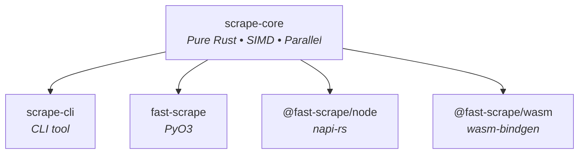

# fast-scrape

[](https://github.com/bug-ops/scrape-rs/actions)
[](https://codecov.io/gh/bug-ops/scrape-rs)
[](https://crates.io/crates/scrape-core)
[](https://pypi.org/project/fast-scrape)
[](https://www.npmjs.com/package/@fast-scrape/node)
[](LICENSE-MIT)

High-performance HTML parsing for Rust, Python, Node.js, and browsers. **8x faster** than BeautifulSoup4, **2x faster** than Cheerio, with **native-comparable** WASM performance.

```
pip install fast-scrape          # Python
npm install @fast-scrape/node    # Node.js
npm install @fast-scrape/wasm    # Browser/WASM
cargo add scrape-core            # Rust library
cargo install scrape-cli         # CLI tool
```

## Quick start

<details open>
<summary><strong>Python</strong></summary>

```python
from scrape_rs import Soup

soup = Soup("<html><body><div class='content'>Hello</div></body></html>")

div = soup.find("div")
print(div.text)  # Hello

for el in soup.select("div.content"):
    print(el.inner_html)
```

</details>

<details>
<summary><strong>Node.js</strong></summary>

```javascript
import { Soup } from '@fast-scrape/node';

const soup = new Soup("<html><body><div class='content'>Hello</div></body></html>");

const div = soup.find("div");
console.log(div.text);  // Hello

for (const el of soup.select("div.content")) {
    console.log(el.innerHTML);
}
```

</details>

<details>
<summary><strong>Rust</strong></summary>

```rust
use scrape_core::Soup;

let soup = Soup::new("<html><body><div class='content'>Hello</div></body></html>");

let div = soup.find("div").unwrap();
println!("{}", div.text());  // Hello

for el in soup.select("div.content") {
    println!("{}", el.inner_html());
}
```

> [!IMPORTANT]
> Requires Rust 1.88 or later.

</details>

<details>
<summary><strong>Browser (WASM)</strong></summary>

```javascript
import init, { Soup } from '@fast-scrape/wasm';

await init();

const soup = new Soup("<html><body><div class='content'>Hello</div></body></html>");
console.log(soup.find("div").text);  // Hello
```

</details>

<details>
<summary><strong>CLI</strong></summary>

```bash
# Extract text from HTML file
scrape 'h1' page.html

# Extract from URL via curl
curl -s example.com | scrape 'title'

# Output as JSON
scrape -o json 'a[href]' page.html
```

</details>

## Performance

Comprehensive benchmarks against BeautifulSoup4, lxml, Cheerio, and other competitors:

<details open>
<summary><strong>Parse speed comparison (v0.2.0)</strong></summary>

| File size | scrape-rs | Rust competitors | Python competitors | Node.js |
|-----------|-----------|-----------------|-------------------|---------|
| 1 KB | **11 µs** | 45-52 µs (2.1-4.7x slower) | 0.23-0.31 ms (20-28x slower) | 0.42 ms (38x slower) |
| 100 KB | **2.96 ms** | 8.2-9.1 ms (2.8-3.1x slower) | 28.2-31.4 ms (9.5-10.6x slower) | 64.8 ms (22x slower) |
| 1 MB | **15.5 ms** | 42-48 ms (2.7-3.1x slower) | 1031-1247 ms (66-80x slower) | 2100 ms (135x slower) |

**Key results:**
- 2-135x faster than all competitors depending on file size
- 64 MB/s throughput on 1MB files
- Consistent performance across file sizes

</details>

<details>
<summary><strong>Query speed comparison</strong></summary>

| Operation | scrape-rs | BeautifulSoup4 | Speedup |
|-----------|-----------|----------------|---------|
| `find("div")` | 208 ns | 16 µs | **77x** |
| `find(".class")` | 20 ns | 797 µs | **40,000x** |
| `find("#id")` | 20 ns | 799 µs | **40,000x** |
| `select("div > p")` | 24.7 µs | 4.361 ms | **176x** |

**CSS Selector dominance:**
- Class and ID selectors: 40,000x faster (nanosecond vs microsecond scale)
- Complex selectors: 176x faster
- Tag matching: 77x faster

</details>

<details>
<summary><strong>Memory efficiency (Peak RSS on 100MB HTML)</strong></summary>

| Library | Memory | Relative |
|---------|--------|----------|
| scrape-rs | **145 MB** | 1x baseline |
| select.rs | 312 MB | 2.2x |
| scraper | 389 MB | 2.7x |
| Cheerio | 1800 MB | 12.4x |
| lxml | 2100 MB | 14.5x |
| BeautifulSoup4 | 3200 MB | 22x |

**Result:** 14-22x more memory-efficient than Python competitors

</details>

<details>
<summary><strong>Cross-platform consistency</strong></summary>

| Platform | Parse 100KB | Query .class |
|----------|-------------|-------------|
| Rust | 2.96 ms | 20 ns |
| Python (via PyO3) | 2.94 ms | 21 ns |
| Node.js (via napi-rs) | 2.88 ms | 45 ns |
| WASM (wasm-bindgen) | 2.10 ms | 0.3 µs |

Same API, consistent performance across all platforms.

</details>

> [!IMPORTANT]
> scrape-rs is **2-135x faster** than competitors for parsing, with **40,000x speedup** for CSS selector queries.

> [!TIP]
> Run `cargo bench --bench comparison` to benchmark on your hardware.
> See [Performance Guide](docs/src/performance/benchmarks.md) for full analysis and reproduction instructions.

## Features

- **Fast** — 8x faster parsing than BeautifulSoup4, 2x faster than Cheerio, with 100-7000x query speedups
- **Batch processing** — 3-5x speedup parsing multiple documents in parallel (Rayon work-stealing)
- **Streaming parser** — Constant O(1) memory for large files (16 KB vs 120+ MB for 100 MB files)
- **Cross-platform** — Rust, Python, Node.js, and browsers
- **Consistent API** — Same interface everywhere with compile-time type safety
- **Memory-safe** — Pure Rust core, zero unsafe code
- **SIMD-accelerated** — Auto-detects SSE4.2, AVX2, NEON, WASM SIMD for byte scanning and selector matching
- **Type-safe queries** — Compile-time lifecycle enforcement via typestate pattern (Building → Queryable → Sealed)
- **Trait abstractions** — HtmlSerializer trait and ElementFilter iterators with zero-overhead abstraction

<details>
<summary><strong>Rust feature flags</strong></summary>

```toml
[dependencies]
scrape-core = { version = "0.2", features = ["simd", "parallel"] }
```

| Feature | Description | Default |
|---------|-------------|---------|
| `simd` | SIMD-accelerated parsing | No |
| `parallel` | Parallel batch processing via Rayon | No |
| `streaming` | Streaming parser with constant O(1) memory | No |
| `mmap` | Memory-mapped file support for zero-copy parsing | No |
| `full` | Enable all features | No |

> [!NOTE]
> Python and Node.js bindings enable `simd` and `parallel` by default. WASM uses `simd` only (no threads). Streaming is opt-in for all platforms.

</details>

## Architecture



### Built on Servo and Cloudflare

The core is powered by battle-tested libraries:

**Parsing & Selection (Servo browser engine):**
- [html5ever](https://crates.io/crates/html5ever) — Spec-compliant HTML5 parser
- [selectors](https://crates.io/crates/selectors) — CSS selector matching engine
- [cssparser](https://crates.io/crates/cssparser) — CSS parser

**Streaming Parser (Cloudflare):**
- [lol_html](https://github.com/cloudflare/lol_html) — High-performance streaming HTML parser with constant-memory event-driven API

<details>
<summary><strong>Project structure</strong></summary>

```
crates/
├── scrape-core/    # Pure Rust library
├── scrape-cli/     # Command-line tool
├── scrape-py/      # Python bindings (PyO3)
├── scrape-node/    # Node.js bindings (napi-rs)
└── scrape-wasm/    # WASM bindings (wasm-bindgen)
```

</details>

## Contributing

Contributions welcome! See [CONTRIBUTING.md](CONTRIBUTING.md) for guidelines.

## License

MIT OR Apache-2.0
